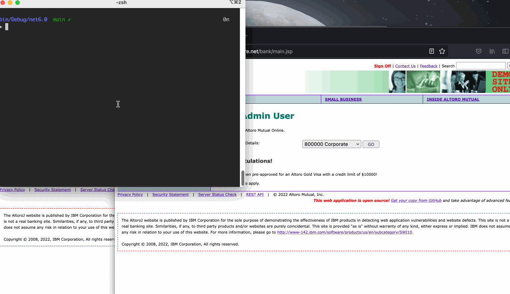

# Altoro 
A collection of attacks against Altoro Mutual's website. 

## Transfer

This attack lets you transfer money between accounts even if you don't own the account. It works because Altoro's website just checks that the account numbers that you're transfering funds between are set in the cookie. There are no checks in the actual code to make sure the user owns the account.

